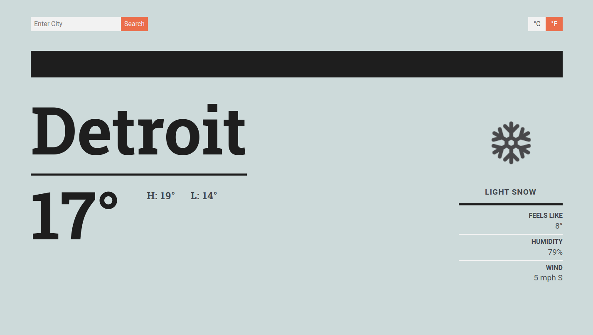
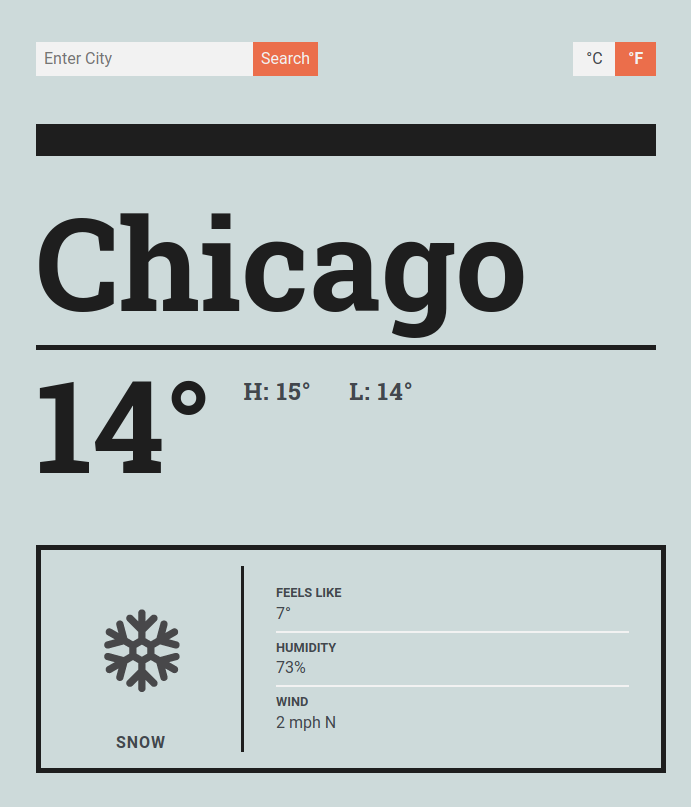
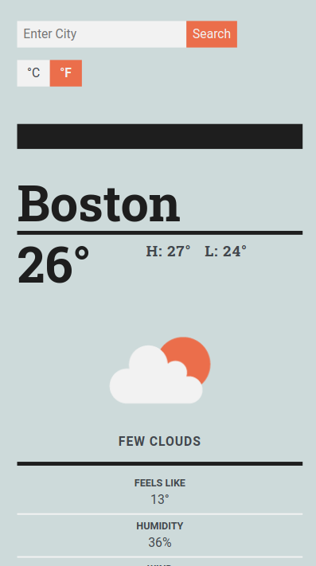

# To Do List Webapp
In progress

[Check it](https://jmilll.github.io/weather-app/)

## Example
* Desktop
* 

* Tablet
* 

* Mobile
* 

[Check it](https://jmilll.github.io/weather-app/)

## Features

* Webpack Bundle.
* Responsive to media size.
* Enter any city to get its weather.
* Change between Fahrenheit and Celcius.
* Offers current temp, hi/lo, precipitation icon, 'feels like' temp, humidity, and windspeed + direction.

## Motivation

The purpose of this project was to work on using Async/Await and promises

## Technologies Used

* Webpack
* JavaScript
* HTML / CSS
* Flexbox

## Acknowledgements

This project was inspired by [The Odin Project](https://www.theodinproject.com/courses/javascript/lessons/weather-app) online learning curriculum.

## License

MIT